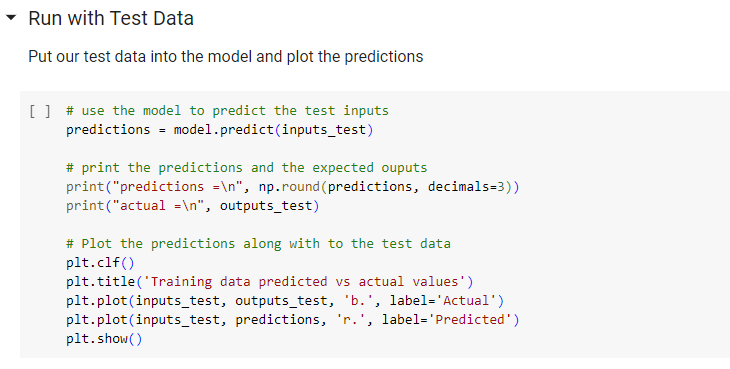
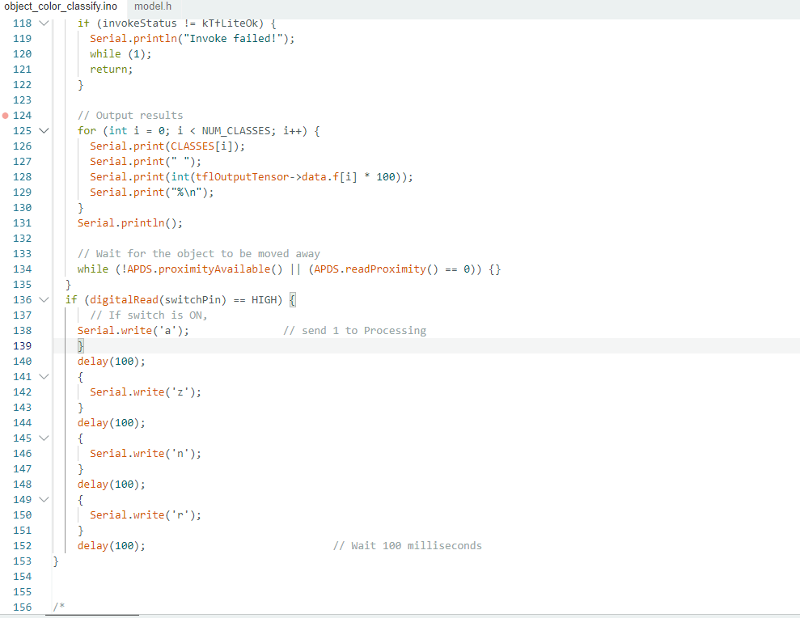
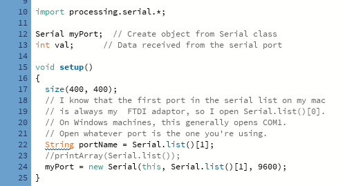
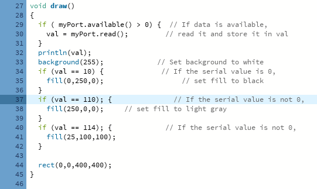

### Contenidos de este repositorio

* carpeta [imagenes/](imagenes/):
   * archivo [arduino_01.png](/imagenes/arduino_01.png)
   * archivo [arduino_02.png](/imagenes/arduino_02.png)
   * archivo [google_colab_01.png](/imagenes/google_colab_01.png)
   * archivo [google_colab_02.png](/imagenes/google_colab_02.png)
   * archivo [google_colab_03.png](/imagenes/google_colab_03.png)
   * archivo [processing_01.png](/imagenes/processing_01.png)
   * archivo [processing_02.png](/imagenes/processing_02.png)
   * archivo [model_h_01.png](/imagenes/model_h_01.png)
* carpeta [arhivos arduino/](/arhivos-arduino):
   * archivo [model.h](model.h)
   * archivo [object color classify](object_color_classify.ino)
* archivo [README.md](README.md)
  
# Sobre reconocimiento de bebidas y sus colorantes

Los colores brillantes atraen a las personas como las flores atraen abejas, esta ha sido una estrategia para vender distintos articulos desde siempre, utilizando diseños con colores fuertes y paquetes brillantes para que un producto llame más la atención que la competencia. Pero cuando utilizamos estos colores para teñir alimentos ¿Estamos seguros de lo que consumimos? ¿Qué es lo que crea estos brillantes colores en nuestras bebidas favoritas?

En este proyecto utilizaremos Arduino para que sea capaz de reconocer los colores fuertes de las bebidas e informarnos cuál es el colorante que se utiliza para teñirlas de esa forma, de esta manera podremos saber qué es realmente lo que provoca el color de la bebida y cómo esto puede afectar a nuestros cuerpos.

 [**Gloria Herrera**](https://github.com/gloriaherrera), [**Amelia López**](https://github.com/Ax0lMar) y [**Camila Méndez**](https://github.com/camilamendezm) para audiv027-2023-2. Electivo Ambas Menciones: Inteligencia Artificial  
DOCENTE: [**Aaron Montoya Moraga**](https://github.com/montoyamoraga) - FAU.UCHILE -  

#### Proyecto funcionando

### Materiales

* Arduino Nano 33LBLE Sense Lite
* Computador
* [Arduino IDE](https://www.arduino.cc/en/software)
* [Processing](https://processing.org/download)
* TensorFlow

### Proceso

* #### Instalar la libreria de TensorFlow Lite.
Para comenzar a trabajar utilizamos como base el codigo de el ejercicio "FruitToEmoji", Principalmente el código existente en "object_color_recognition" y también "object_color_classify", el que editaremos como sea necesario para permitir nuestro trabajo.
  
* #### Crear base de datos en Arduino con los colores de las bebidas reconociendo los colores Amarillo, Azul, Naranja y Rojo.
Para la creación de esta librería utilizamos "object_color_recognition" y las bebidas Kem piña (Amarillo), Gatorade Cool blue (Azul), Fanta (Naranja) y finalmente Bilz (Rojo), reconociendo sus colores con luz natural, luz tenue y luego alumbrando las botellas con una linterna, de manera que la librería contara con una amplia variedad de tonos para cada bebida y asi reconocerlas con mas facilidad en distintos ambientes.
  
* #### Ingresar base de datos al código en [Google Colab](https://colab.research.google.com/github/arduino/ArduinoTensorFlowLiteTutorials/blob/master/FruitToEmoji/FruitToEmoji.ipynb)
Al entrenar el modelo nos encontramos con un problema, puesto que el Google Colab no esta preparado para trabajar con 4 colores, para poder hacerlo funcionar tuvimos que encontrar cuál era la parte del proceso que impedía la producción del archivo "model.h" 

* #### Eliminar la sección “Run with Test Data”.
Finalmente encontramos cual era el problema que impedía la realización de este archivo, y logramos resolverlo simplemente eliminando el paso "Run with Test Data" que solo permitía el análisis de 3 colores. (foto)

* #### Descargar carpeta model.h.

* #### Ingresar los resultados en Arduino IDE.
Luego se coloca el archivo resultante del entrenamiento, el archivo "model.h" en la misma carpeta que el sketch "object_color_classify" para que el código pueda encontrarla y leer la base de datos de colores recopilados.

* #### Modificar código en Arduino IDE, añadiendo una variable, cambiando los nombres y otorgarles un carácter.

**Processing**
  
(aquí agregar la info de cada colorante en la clasificacion de los nombres que supuestamente iban a salir en la graficacion, Acido carminico (rojo), Tartrazina (amarillo), Betacaroteno (naranja) y Azul brillante (FCF) (Azul).)
* Colocar el ejemplo SimpleRead en Processing (Archivo - Ejemplos - Bibliotecas - Serial - SimpleRead).
* Cambiar línea 22 del código para saber el puerto que está ocupando nuestro Arduino (captura)

* En processing, agregar valores y asignarles colores en RGB a cada uno. (captura)

### Referentes

[Fruit identification using Arduino and TensorFlow](https://blog.arduino.cc/2019/11/07/fruit-identification-using-arduino-and-tensorflow)

## Conclusiones

Aprendizajes:

* #### Trabajo colaborativo
Si bien ya habíamos trabajado de manera colaborativa en proyectos anteriores, en este caso utilizamos un Arduino con el que teníamos que turnarnos para trabajar en casa como también hacernos el tiempo para juntarnos a trabajar tanto fisicamente en la universidad, como tambien virtualmente mediante discord. 

* #### Arduino IDE
Trabajamos principalmente en Arduino por lo que logramos comprender que hacían las distintas partes del código, cómo modificarlo y hacer que aun así funcione.

* #### Colorantes alimentarios
Durante la investigación para estre proyecto investigamos sobre el verdadero efecto que pueden tener los colorantes alimentarios de las bebidas en nuestros organismos, algunos de ellos causando grave daño a nuestra digestión o acelerando enfermedades terminales graves. 

Dificultades:
* Processing
* Modificar códigos
